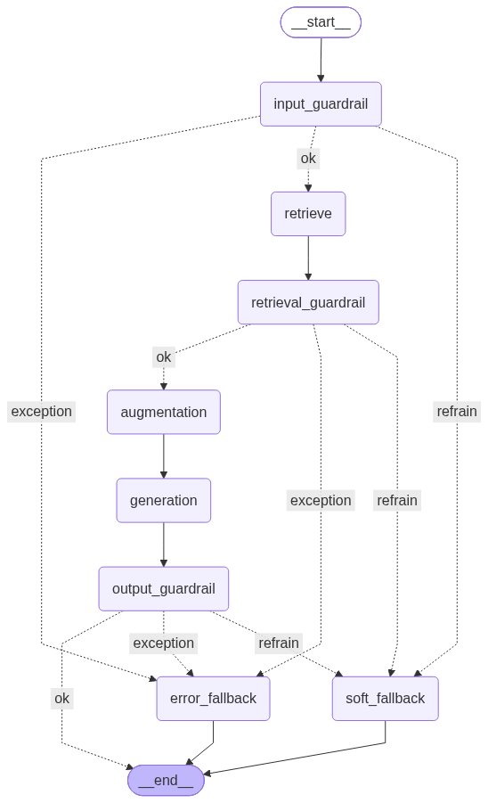

# LLMOps RAG App

A production-oriented Retrieval-Augmented Generation service that demonstrates a complete LLMOps lifecycle: layered guardrails, externalized prompt management, synthetic evaluation-set generation, LLM-as-judge offline evaluation, experiment tracking, and automated regression/promotion gates.

<p>
  
  
  
  
  
  
</p>

---

## Overview

The service answers user questions grounded in a corpus of long-form transcript documents. Retrieval and generation run as an explicit LangGraph state machine, with validation gates wrapped around the user query, the retrieved context, and the generated answer. Around the runtime sits an offline evaluation and experiment-tracking pipeline that scores every change against a versioned metric baseline and blocks regressions before a prompt or configuration is promoted.

**Highlights**

- **Graph-based RAG** — retrieval, augmentation and generation as discrete, individually testable LangGraph nodes.
- **Three-layer guardrails** — jailbreak / PII / topic checks on input, prompt-injection detection on retrieved context, and relevancy checks on output, with graceful `exception` / `refrain` fallbacks.
- **Externalized prompts** — the system prompt is versioned and label-promoted in Langfuse, never hard-coded.
- **Synthetic evaluation data** — golden Q&A pairs are generated from the corpus with DeepEval's `Synthesizer` (filtration + evolution), then curated.
- **LLM-as-judge evaluation** — a 7-metric RAG suite (contextual recall/precision/relevancy, answer relevancy, faithfulness) plus custom `GEval` criteria.
- **Experiment tracking** — every evaluation run logs params, metrics, datasets, prompt and code artifacts to MLflow (DagsHub-hosted).
- **Statistical promotion gates** — noise- and drift-aware thresholds gate regression and champion promotion decisions in CI-style pytest checks.
- **Idempotent ingestion** — content-hashed chunks mean re-syncing the corpus only re-embeds what changed.

## Architecture

```
Streamlit UI ──HTTP──▶ FastAPI ──▶ LangGraph (guardrailed RAG) ──▶ Chroma + OpenAI
                          │
                          └─ /internal/vector-store  ── ingestion (admin-key protected)

params.yaml ──▶ Pydantic config ──▶ shared LLM / retriever / logger
Langfuse ──▶ system prompt (fetched by label at runtime)
```

The served graph:



Each guardrail node emits a status of `ok`, `exception`, or `refrain`. `exception` routes to a critical fallback message; `refrain` routes to a soft fallback asking the user to rephrase. The plain (non-guardrailed) graph is retained for evaluation, where it produces the `actual_output` scored against the golden set.

### Repository layout

| Path | Purpose |
| --- | --- |
| `src/app/` | RAG graphs, guardrails, vector store, Langfuse prompt lifecycle |
| `src/api/` | FastAPI app — `chat`, `health`, and admin `vector-store` routers |
| `src/frontend/` | Streamlit chat client |
| `src/config/` | `params.yaml` loading + strict Pydantic validation |
| `src/data/` | Golden-set synthesis and evaluation-set generation |
| `src/evals/` | DeepEval metric suite and standalone metric checks |
| `utils/` | Transcript cleaning, MLflow helpers |
| `execute_experiment_pipeline.py` | End-to-end evaluate + track pipeline |
| `compute_*_thresholds.py` | Recompute noise / historical metric thresholds from run history |
| `tests/` | `test_regression.py`, `test_promotion.py`, and manual API demo scripts |
| `notebooks/` | Component prototypes (baseline RAG, per-layer guardrails) |
| `reports/` | Timestamped evaluation reports and results |

## Tech stack

| Concern | Tooling |
| --- | --- |
| Orchestration | LangGraph, LangChain |
| Vector store | Chroma (persistent) |
| Models | OpenAI chat + embeddings (configurable in `params.yaml`) |
| Guardrails | Guardrails AI + hub validators (jailbreak, PII, prompt-injection, relevancy, reading-time) |
| Prompt registry & tracing | Langfuse |
| Evaluation | DeepEval (`Synthesizer`, RAG metrics, `GEval`) |
| Experiment tracking | MLflow, DagsHub |
| API / UI | FastAPI, Uvicorn, Streamlit |
| Tooling | uv, Pydantic, pytest |

## Getting started

### Prerequisites

- Python 3.12
- [`uv`](https://docs.astral.sh/uv/)
- API access for OpenAI, Langfuse, and a DagsHub-hosted MLflow tracking server

### Installation

```bash
uv sync
```

This resolves dependencies and installs the first-party packages (`api`, `app`, `config`, `data`, `evals`, `frontend`, `utils`) in editable mode.

Download the models required by the guardrail validators (one-time):

```bash
bash install_guardrail_models.sh
```

### Configuration

Create a `.env` file in the project root:

```dotenv
OPENAI_API_KEY=...
LANGFUSE_SECRET_KEY=...
LANGFUSE_PUBLIC_KEY=...
LANGFUSE_BASE_URL=https://cloud.langfuse.com
ADMIN_API_KEY=...
```

Runtime behaviour (models, chunking, retrieval `k`, contextual compression, prompt label) is controlled by [`params.yaml`](params.yaml) and validated on load.

Register the system prompt in Langfuse before first run:

```bash
uv run python src/app/update_system_prompt.py
```

### Running the service

```bash
# API
uv run uvicorn api.main:app --reload --app-dir src

# Frontend (expects the API on http://127.0.0.1:8000)
uv run streamlit run src/frontend/app.py
```

### Ingesting documents

Place transcript files in `data/raw/`, then trigger a sync (cleans, chunks, embeds, and upserts — only changed chunks are re-embedded):

```bash
uv run python tests/demo_transcript_sync.py   # uses ADMIN_API_KEY from .env
```

## API

| Method | Endpoint | Auth | Description |
| --- | --- | --- | --- |
| `POST` | `/chat` | — | Streams a grounded answer for `{"query": "..."}` |
| `GET` | `/chat/files` | — | Lists indexed source documents |
| `GET` | `/health` | — | Liveness |
| `GET` | `/health/dependencies` | — | Live LLM + retriever probes |
| `GET` | `/internal/vector-store/chunks/count` | `X-Admin-Key` | Chunk count for the collection |
| `POST` | `/internal/vector-store/transcripts/sync` | `X-Admin-Key` | Clean, chunk, embed and upsert `data/raw/` |

## LLMOps workflow

### Evaluation

```bash
uv run python execute_experiment_pipeline.py
```

Within a single MLflow run this:

1. logs the flattened `params.yaml`;
2. builds the evaluation set by running every golden question through the RAG graph;
3. scores it with the DeepEval suite (LLM-as-judge) and writes Markdown + JSON reports to `reports/`;
4. logs metrics, datasets, the active system prompt, and source files as artifacts;
5. appends the run to `historical_runs.json`.

Regenerate the golden set from the corpus:

```bash
uv run python src/data/generate_goldens.py
```

### Promotion & regression gates

Metric thresholds in [`thresholds.json`](thresholds.json) capture two kinds of variance:

- **noise** — run-to-run standard deviation for an unchanged configuration;
- **historical** — standard deviation across accepted runs.

The gates compare the latest run against the current champion (the MLflow run tagged `stage=staging`):

```bash
uv run pytest tests/test_regression.py    # fails on a drop beyond staging − 2·(historical + noise)
uv run pytest tests/test_promotion.py     # fails unless ≥ 5/7 metrics ≥ staging and none regress beyond 2·noise
```

Recompute thresholds after accumulating new runs:

```bash
uv run python compute_noise_thresholds.py
uv run python compute_historical_thresholds.py
```

### Prompt management

The system prompt is stored in Langfuse and fetched at runtime by the label set in `params.yaml` (`prompt_label`). `src/app/system_prompt_versioning.py` moves labels between versions to promote a prompt without a code change.

## Testing

```bash
uv run pytest tests/
```

`test_regression.py` and `test_promotion.py` require network access to the MLflow tracking server and a run tagged `stage=staging`. The `tests/demo_*.py` scripts are manual API exercises (a live server is required) and are excluded from collection by name.

## License

Not yet specified.
